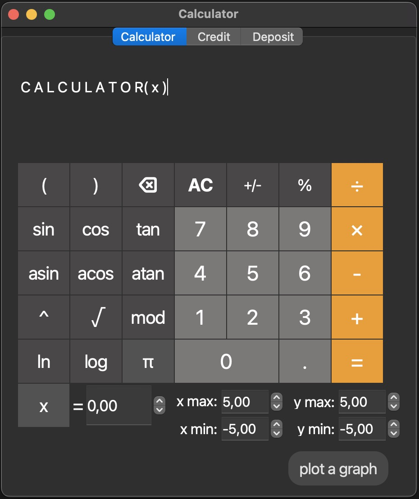

# Calculator

## Introduction

This project aims to develop an enhanced calculator, designed using structured programming principles and implemented in the C/C++ programming language. This extended calculator, beyond the standard arithmetic operations found in typical operating system applications, offers the capability to evaluate complex arithmetic expressions following the appropriate order of operations. Additionally, it includes various mathematical functions, such as sine, cosine, and logarithms.

In addition to its mathematical capabilities, this calculator supports the use of a variable _x_ and facilitates the graphical representation of corresponding functions.

Furthermore, the project considers a credit and deposit calculator.



### Technologies

\- stack / queue \
\- Qt \
\- reverse Polish notation \
\- Dijkstra's algorithm \
\- test with check.h \
\- gcov report

## Installing

1. Clone project

```
git clone https://github.com/awesic/Calculator.git
```

2. Go to the `src` folder

3. Install calculator

> ❗️ first of all, you should install `qmake` (for install), `check` (for tests), `lcov` (for coverage report).

```
make install
```

### QMake install

**Mac OS**

```
brew install qt
```

**Linux**

QMake is likely part of your distribution’s packages. Use the following commands to search for the most recent version:

**Debian / Ubuntu:** apt search qmake \
**RedHat Enterprise Linux / CentOS / Fedora:** yum provides \*bin/qmake\*

**Windows**

Download Qt from https://www.qt.io/download.

4. Open Applications, find Calculator app and enjoy

## Targets in Makefile

**all**: \
&nbsp; &nbsp; &nbsp; &nbsp; build the project

**build**: \
&nbsp; &nbsp; &nbsp; &nbsp; launch with qmake project

**install**: \
&nbsp; &nbsp; &nbsp; &nbsp; install the calculator to your Applications folder (if you're not mac user change APPLICATIONS variable in Makefile)

**uninstall**: \
&nbsp; &nbsp; &nbsp; &nbsp; delete the calculator from Applications folder

**clean**: \
&nbsp; &nbsp; &nbsp; &nbsp; remove all object , executable and created by qmake files

**dvi**: \
&nbsp; &nbsp; &nbsp; &nbsp; its like mini documantation (html file)

**dist**: \
&nbsp; &nbsp; &nbsp; &nbsp; make tar archieve from project

**test**: \
&nbsp; &nbsp; &nbsp; &nbsp; run tests

**gcov_report**: \
&nbsp; &nbsp; &nbsp; &nbsp; do coverage analysis of code

**leaks**: \
 &nbsp; &nbsp; &nbsp; &nbsp; check leaks in the code
